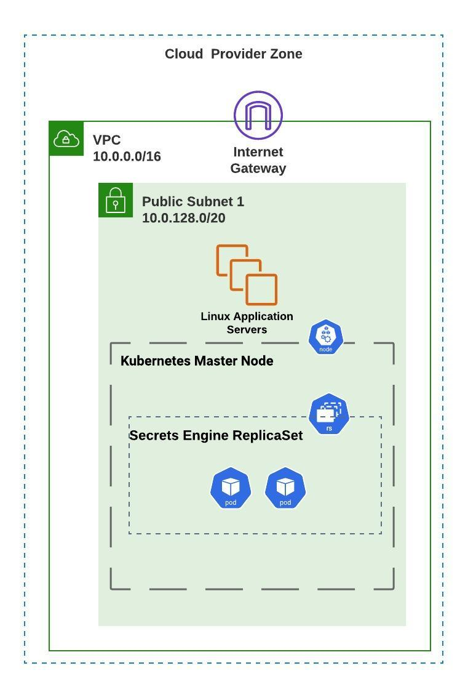

# Governing Self-Service Cloud Provisioning

Cloud providers have developed mature, feature-rich platforms that allow organizations to deploy innovative applications and services. For domain experts(network, database, linux/windows administration, etc.), this high level of control fosters innovation and is appreciated.

<!-- There are several
**Sandboxing** -->

Although these domain experts produce repeatable solutions to known business needs, they can add automation and self-service to make cloud provisioning accessible to a wider audience in the organization. There are a few reasons orgs would want to do this:

- **Speed of Delivery:** Mature automation can be run by end-users with stripped-down options and less roadblocks, allowing business-critical applications/solutions to be delivered more quickly.
- **Silo breakdown:** Automation of infrastructure/application provisioning encourages multiple teams of domain experts (network, application, database, etc.) to work together, preparing a holistic solution to a known business need.
- **Enables Innovation:** When common cloud workloads are automated and presented with self-service delivery, domain experts are free to focus on the innovative solutions they were hired to develop.

Self-service cloud automation allows end-users to easily create on-demand, ephemeral workloads. This repository contains an 'art-of-the-possible' demonstration of this very concept. Ansible playbooks are run to accomplish the following:
- Create a cloud virtual private cloud with a public subnet
- Creates a number of Red Hat Enterprise Linux instances, with the following attributes:
  - Includes a set of pre-defined users, each with privilege-escalation rights and that must create a new password upon first login.
  - Hosts an Apache webserver and dynamically generated index.html page.
  - Is registered with Red Hat Insights.
- Creates a container-based secrets engine that holds the SSH private keys for the predefined linux user passwords

A visual representation of the final product can be seen here:

<!---  --->

The Ansible playbooks are implemented with the following Ansible Tower Workflow Template (for separation of responsibilities and error handling):

<!---  --->

Finally, the end-user can accomplish all of this with a simplified interface, such as a ServiceNow catalog item:

<!---  --->

Let's walk through the Ansible playbooks and 3rd-party integration instructions in this repository to see how this is accomplished.

# Table Of Contents
- [Demo Prerequisites and Required Variables](readme/prereqs_and_vars.md)
- [Preparing Ansible Tower Project and Cloud Credentials](readme/tower_setup.md)
- [Setting up the Ansible Tower Workflow](readme/tower_workflow.md)
- [The Payoff: Deploying Your Cloud Workload](readme/workflow_kickoff.md)
- [Bonus: Deploying Your Cloud Workload via ServiceNow](readme/snow_integration.md)
