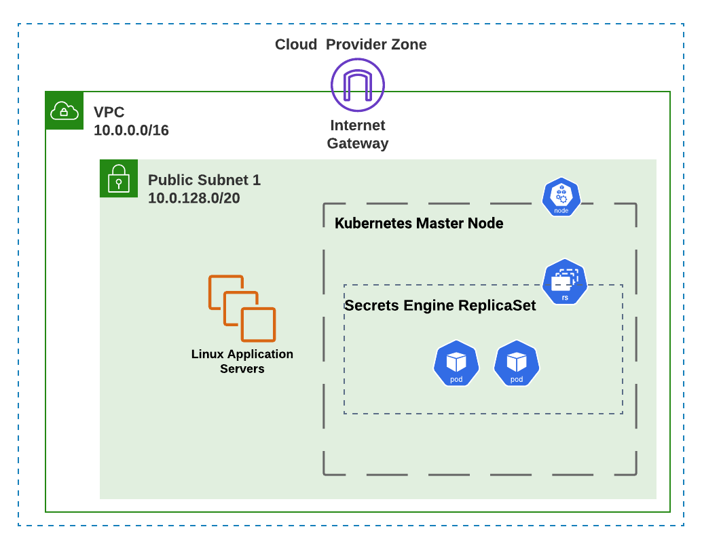
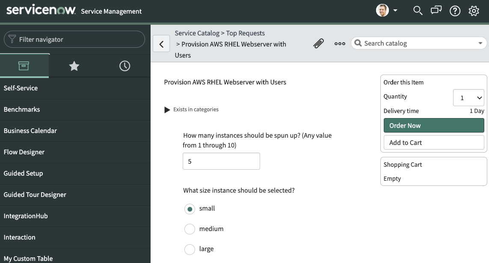

# Governing Self-Service On-Demand Cloud Provisioning

<!-- Cloud providers have developed mature, feature-rich platforms that allow organizations to develop innovative applications and services. For domain experts(network, database, linux/windows administration, etc.), this high level of control fosters innovation and is appreciated. Taking this one step further, taking the infrastructure  -->

Everyone in the enterprise organization is taking advantage of public cloud to complete their respective jobs, and although they may not know it, the infrastructure they consume to do so is provisioned on-demand. For the enterprise, this lowers costs and increases business agility.

End-users that are more directly interacting with public cloud to get work done may not have expertise in the cloud console and/or API(and in most cases should not be given access anyhow), but still need to be given a simple interface to provision and teardown on-demand workloads when needed. How can we do this?

Combining peer-reviewed, Infrastructure-as-Code automation, least-privilege user access, and simple GUI interfaces, you can empower these end-users to set up the on-demand workloads that allow them to complete the tasks at hand, such as:
- Setting up a sandbox environment for testing purposes
- Implementing disaster recovery of an application in a different public cloud region (this can also be automated based on a monitoring event)
- Setting up infrastructure for on-demand data processing

This repository contains an 'art-of-the-possible' demonstration of this very concept. Ansible playbooks are run to accomplish the following:
- Create a cloud virtual private cloud with a public subnet in either **AWS** or **GCP**
- Creates a number of Red Hat Enterprise Linux instances, with the following attributes:
  - Includes a set of pre-defined users, each with privilege-escalation rights and that must create a new password upon first login.
  - Hosts an Apache webserver and dynamically generated index.html page.
  - Is registered with Red Hat Insights
- Creates a container-based secrets engine that holds static SSH private keys for the predefined linux user passwords

A visual representation of the final product can be seen here:

The Ansible playbooks are implemented with the following Ansible Tower Workflow Template (for separation of responsibilities and error handling):

Finally, the end-user can accomplish all of this with a simplified interface, such as a ServiceNow catalog item:

Let's walk through the Ansible playbooks and 3rd-party integration instructions in this repository to see how this is accomplished.

# Table Of Contents
- [Demo Prerequisites and Required Variables](readme/prereqs_and_vars.md)
- [Preparing Ansible Tower Project and Cloud Credentials](readme/tower_setup.md)
- [Setting up the Ansible Tower Workflow](readme/tower_workflow.md)
- [The Payoff: Deploying Your Cloud Workload](readme/workflow_kickoff.md)
- [Bonus: Deploying Your Cloud Workload via ServiceNow](readme/snow_integration.md)
