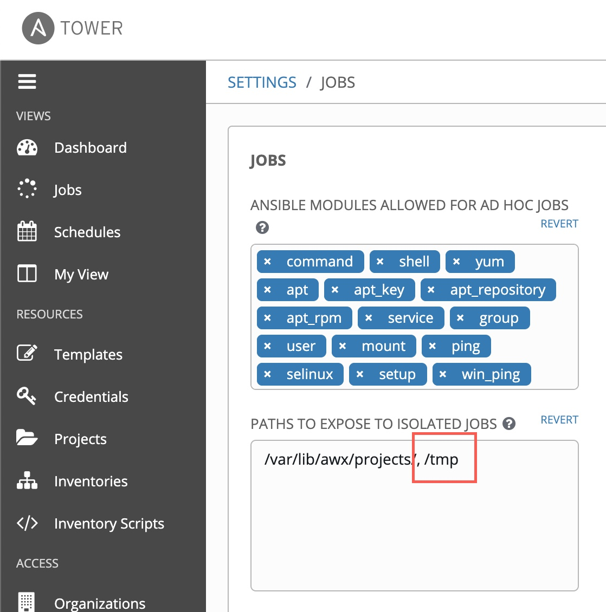

# Demo Prerequisites and Required Variables

This document lists the software requirements needed to set up this demonstration, and the variables/credentials needed to run the ansible playbooks properly.


# Table Of Contents
- [Software Requirements](#requirements)
- [Variables](#variables)
  * [default-vars.yml](#default-variables)
  * [linux_users.yml](#linux-users)
- [Credentials](#credentials)
  * [gmail_creds.yml](#gmail-credentials)
  * [redhat-activation-key.yml](#redhat-activation-key)
  * [snow_creds.yml](#servicenow-credentials)
  * [tower_creds.yml](#tower-credentials)
  * [vault_creds.yml](#hashicorp-vault-credentials)

## Requirements

- **Ansible Tower 3.7 or later**: Ansible Tower is what organizations use to operationalize/scale automation. You can look [here](https://docs.ansible.com/ansible-tower/latest/html/quickinstall/index.html) to obtain and install it. Deploying in a cloud environment makes this demo easier as you may want to have ServiceNow be able to communicate with Ansible Tower.
- **Ansible Tower License**: Required to be able to automate against the instances and containers you will be deploying.
  - A 60-day, 100-node trial license can be generated here: [Ansible Tower 60-day trial license](https://www.redhat.com/en/technologies/management/ansible/try-it).
- **ServiceNow Developer Instance**: Optionally, ServiceNow (or any ticketing system that can make outbound RESTful API calls) can be used to programmatically start this deployment. Many organizations use ServiceNow as a front-end for self-service IT, and Ansible Tower allows end-users to continue utilizing an interface they are accustomed to.
  - Instructions on how to set up a free developer instance of ServiceNow can be found [here](https://developer.servicenow.com/dev.do#!/guide/orlando/now-platform/pdi-guide/obtaining-a-pdi).
- **Programmatic Cloud Credentials**: Ansible needs credentials to be able to talk to your cloud environment. Alternatively, if you deploy Ansible Tower in the same cloud environment where you plan to run this demo, you can give the instance itself permissions (such as an AWS Identity Access Management Role) to access the necessary cloud resources. Currently, this demo deploys resources in AWS and GCP, and will be expanding to include Azure.

## Variables

### default-variables

The [default variables file](../vars/default-vars.yml) contains the basic variables needed to set up the cloud infrastructure. In some cases (such as VPC subnets and the VM image ID), these variables are hard-coded for simplicity's sake; in production there would be logic to dynamically change the values. You can of course change these values yourself.

#### cloud-agnostic variables
- `working_dir`: Starting with Ansible Tower 3.6, Job and Workflow Templates are executed in a temporary directory. When running a Workflow Template, any artifact created in an individual Job Template will not persist by default. This is where the `working_dir` variable comes into play. `working_dir` defines a directory where artifacts are placed for the life of the workflow. It is important that this directory is made writable by Ansible Tower, and this can be done in the Ansible Tower settings:


<!--  -->
- `cloud_provider`: Dictates which public cloud provider resources will be deployed in. Valid options are **aws** or **gcp**.
- `num_instances`: The number of linux instances to deploy. This value will be overridden by the one specified in the Ansible Tower Workflow Template.
- `application`: As this demo supports more applications, this variable will indicate which application was deployed. This value is used to mark newly created instances via AWS tags or GCP labels.
- `from_snow`: This indicates whether or not the Workflow Template was called from ServiceNow, or Ansible Tower. When this value is `true`, a ServiceNow Change Request is created and modified/closed as the Workflow Template progresses.

### AWS-specific variables (if `cloud_provider` is **aws**)
- `ec2_region`: Dictates the AWS region in which all resources will be provisioned.
- `ec2_prefix`: The prefix that will appear in the names of all AWS resources (VPC, subnets, security groups, etc.) created in this demo.
- `ec2_image_id`: The AMI used to deploy linux. In the sample file, this is **RHEL 8**.
- `ec2_wait`: Determines whether to wait for the ec2 instance to reach its desired state before returning from creation.
- `ec2_vpc_subnet`: The IP Subnet assigned to the AWS subnet that is created.
- `ec2_vpc_cidr`: The IP Subnet assigned to the AWS VPC that is created.
- `ec2_root_volume_size`: The size of the Elastic Block Store volumes tied to the linux instances created, in GB.

### GCP-specific variables (if `cloud_provider` is **gcp**)
`gcp_region`: Dictates the GCP region in which all resources will be provisioned.
`gcp_zone`: Dictates the GCP zone in which all resources will be provisioned.
`gcp_prefix`: The prefix that will appear in the names of all GCP resources (VPC, subnets, firewall, etc.) created in this demo.
`gcp_disk_image`: The GCP image used to deploy linux. In the sample file, this is **RHEL 8**.
`gcp_vpc_subnet`: The IP Subnet assigned to the GCP network that is created.

### linux-users

The [linux users file](../vars/linux_users.yml) contains a list of users to add to the provisioned linux instances. These users will have the ability to use privilege escalation, and also be forced to create a password when they first log in via SSH private key.

## Credentials

This demonstration requires credentials (in YAML format) in order to integrate with other platforms. The credential files in this repository are all encrypted with [ansible-vault](https://docs.ansible.com/ansible/latest/user_guide/vault.html), and the ansible-vault credential is passed to every Job Template where any of the credentials are required. In the next page of instructions where Job Templates are references, I will refer to this as `ansible-vault password`. Each of these files must be present in order for this demonstration to work; the variables in each credential file are listed here:

### gmail-credentials

This is to simulate a use case where an email is sent to the required approvers when a ServiceNow Change Request is made. the email address here is used to send an approval request.

In the case of a gmail using multi-factor authentication, the password has to be an application-specific password generated in your gmail security settings.

File format:
```
---
gmail_username: user@gmail.com
gmail_password: password
```

### redhat-activation-key

When provisioning RHEL instances, this activation key (generated at https://access.redhat.com) is used to subscribe instances using subscription-manager. <!-- Alternatively, you can elect to deploy non-RHEL linux instances (Centos is suggested). -->

File format:
```
---
rhactivationkey: the-activation-key
rhorg_id: "99999999"
```

### servicenow-credentials

The credentials and name of developer instance used to kick off self-service of cloud provisioning via a Catalog item.

File format:
```
---
SNOW_USERNAME: admin
SNOW_PASSWORD: password
SNOW_INSTANCE: dev99999
```
### tower-credentials

The url and credentials for the demo to populate Ansible Tower resources, such as the SSH private key generated from the cloud provider.

File format:
```
---
tower_url: https://ansible.tower.com
tower_user: admin
tower_pass: password
```

### hashicorp-vault-credentials

As part of this demo, a Hashicorp vault container is created to store the user credentials externally. Instead of a randomly generated root token for login, you can select an easy-to-remember root token (this is of course for demo purposes, only).

File format:
```
---
vault_root_token: thetoken
```

## Next Steps

- Go back to the first page of instructions: [Governing Self-Service Cloud Provisioning](../README.md)
- Continue to the next step: [Preparing Ansible Tower Project and Cloud Credentials](tower_setup.md)

<!---
The goal of this repository is to demonstrate self-service provisioning of cloud infrastructure and applications using [Ansible Automation Platform](https://www.ansible.com/products/automation-platform) on the backend, and [ServiceNow](https://www.servicenow.com/now-platform.html) to start the process.

Provisioning infrastructure (bare-metal, cloud VMs, serverless) with Ansible allows you to seamlessly transition into configuration management, orchestration and application deployment using the same simple, human readable, automation language. Taking this one step further, running Ansible Automation Platform enables integration with your existing platforms to power self-service automation for people of various skill levels - domain expert, junior architect, operations specialist, etc.

Here you will find Ansible playbooks to automate the deployment of linux servers and applications on AWS (we can of course use similar playbooks against other major cloud providers and on-premise orchestrators). These playbooks are meant to be primarily for demonstrations, showing the "art of the possible" and ephemeral in nature. Additionally, these playbooks are meant to be run as part of an Ansible Tower Workflow rather than run independently.

**Prerequisites**:

- [Ansible Tower 3.7+ installation Guide](https://docs.ansible.com/ansible-tower/latest/html/quickinstall/index.html).
- [Ansible Tower 60-day trial license](https://www.redhat.com/en/technologies/management/ansible/try-it).
- [ServiceNow Developer Instance](https://developer.servicenow.com/dev.do#!/guide/orlando/now-platform/pdi-guide/obtaining-a-pdi). --->
