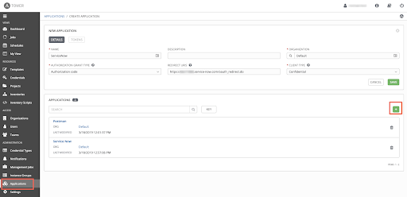
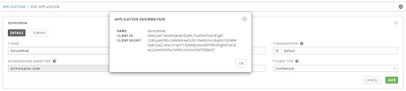
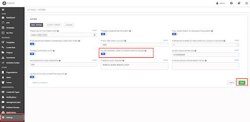
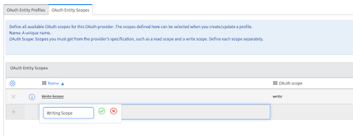

# Bonus: Deploying Your Cloud Workload via ServiceNow (Documentation still in development)

Although this demo now works in Ansible Tower, many end-users do not want to learn a new interface in order to perform their tasks. This is not a problem at all for Ansible Tower, which provides a RESTful API to allow 3rd-party platforms to kick of jobs programmatically. As ServiceNow is widely used in organizations, these instructions walk you through setting up ServiceNow to start this demonstration in Ansible Tower.

If you sign up for a ServiceNow Developer account, ServiceNow offers a free instance that can be used for replicating and testing this functionality. You can visit [this link](https://developer.servicenow.com/dev.do#!/guide/orlando/now-platform/pdi-guide/obtaining-a-pdi) to obtain ServiceNow Developer Instance.

## Notes
- These instructions assume that there is no MID-Server for ServiceNow, and that the ServiceNow developer instance and Ansible Tower can talk to each other directly over the public internet.
- This has been tested with:
  - Ansible Tower 3.6, 3.7
  - ServiceNow Orlando Release

## Dependencies:

### Python libraries

```bash
pip3 install pysnow
```
This python package must be installed in the Ansible Tower Python virtual environment that is used to run playbooks that communicate with ServiceNow.

### Collections

```bash
ansible-galaxy collection install servicenow.servicenow
```
This collection is already present in this repository and the above is the command that was run to retrieve it.

## ServiceNow/Ansible Tower Integration Instructions

### Preparing Ansible Tower

#### 1)
In Ansible Tower, navigate to **Applications** on the left side of the screen. Click the **green plus button** on the right, which will present you with a Create Application dialog screen. Fill in the following fields:
| Parameter | Value |
|-----|-----|
| Name  | Descriptive name of the application that will contact Ansible Tower  |
|  Organization |  `Default` |
|  Authorization Grant Type |  `Authorization code` |
|  Redirect URIs |  `https://<snow_instance_id>.service-now.com/oauth_redirect.do` |
|  Client Type |  `Confidential` |



#### 2)
Click the green **Save** button on the right, at which point a window will pop up, presenting you with the Client ID and Client Secret needed for ServiceNow to make API calls into Ansible Tower. This will only be presented **ONCE**, so capture these values for later use.



#### 3)
Next, navigate to **Settings-->System** on the left side of the screen. You’ll want to toggle the **Allow External Users to Create Oauth2 Tokens** option to ***on***. Click the green **Save** button to commit the change.



#### 4)
The Orlando release of the ServiceNow developer instance does not seem to allow for the self-signed certificate provided by Ansible Tower. We need to equip our Tower instance with a certificate from a trusted Certificate Authority. The easiest way to accomplish this to run the Certbot ACME client in order to generate a certificate from LetsEncrypt (instructions can be found [here](https://letsencrypt.org/getting-started/)). It is important to place the contents of the certificate you generate, followed by the LetsEncrypt intermediate certificate (starting on a new line) at location Tower places its self-signed certificate, /etc/tower/tower.cert. The LetsEncrypt intermediate certificate can be found [here](https://letsencrypt.org/certificates/). Be sure to restart the nginx service on your Tower server after updating the certificate.

### Preparing ServiceNow

#### 5)
Moving over to ServiceNow, Navigate to **System Definition-->Certificates**. This will take you to a screen of all the certificates Service Now uses. Click on the **blue New button**, and fill in these details:
| Parameter | Value |
|-----|-----|
| Name  | Descriptive name of the certificate  |
|  Format |  `PEM` |
|  Type |  `Trust Store Cert` |
|  PEM Certificate |  The certificate to authenticate against Ansible Tower with. Use the certificate you just generated on your Tower server, located at `/etc/tower/tower.cert.` Copy the contents of this file (EXCLUDE the intermediate certificate) into the field in ServiceNow. |


Click the **Submit** button at the bottom.

#### 6)
In ServiceNow, Navigate to **System OAuth-->Application Registry**. This will take you to a screen of all the Applications ServiceNow communicates with. Click on the **blue New button**, and you will be asked What kind of Oauth application you want to set up. Select **Connect to a third party Oauth Provider**.


#### 7)
On the new application screen, fill in these details:


| Parameter | Value |
|-----|-----|
| Name  | Descriptive Application Name  |
|  Client ID |  The Client ID you got from Ansible Tower |
|  Client Secret |  The Client Secret you got from Ansible Tower |
|  Default Grant Type |  `Authorization Code` |
|  Token URL |  `https://<tower_url>/api/o/token/` |
|  Redirect URL |  `https://<snow_instance_id>.service-now.com/oauth_redirect.do` |

Click the **Submit** button at the bottom.

#### 8)
You should be taken out to the list of all Application Registries. Click back into the Application you just created. At the bottom, there should be two tabs: Click on the tab **Oauth Entity Scopes**. Under here, there is a section called **Insert a new row…**. Double click here, and fill in the field to say Writing Scope. Click on the **green check mark** to confirm this change. Then, right-click inside the grey area at the top where it says Application Registries and click Save in the menu that pops up.



#### 9)
The writing scope should now be Clickable. Click on it, and in the dialog window that you are taken to, type **write** in the Oauth scope box. Click the **Update** button at the bottom.


#### 10)
Back in the Application Settings page, scroll back to the bottom and click the **Oauth Entity Profiles** tab. There should be an entity profile populated - click into it.


#### 11)
You will be taken to the Oauth Entity Profile Window. At the bottom, Type Writing Scope into the Oauth Entity Scope field. Click the green check mark and **update**.


#### 12)
Navigate to **System Web Services-->Outbound-->REST Messages**. Click the blue **New** button. In the resulting dialog window, fill in the following fields:


| Parameter | Value |
|-----|-----|
| Name  | `Provision Cloud Webservers with Users`  |
|  Endpoint |  The url endpoint of the Ansible Tower action you wish to do. This can be taken from the browsable API at `https://<tower_url>/api` |
|  Authentication Type |  `Oauth 2.0` |
|  Oauth Profile |  Select the Oauth profile you created |

Right-click inside the grey area at the top; click **Save**.

#### 13)
Click the **Get Oauth Token** button on the REST Message screen. This will generate a pop-up window asking to authorize ServiceNow against your Ansible Tower instance/cluster. Click Authorize. ServiceNow will now have an Oauth2 token to authenticate against your Ansible Tower server.


#### 14)
Under the HTTP Methods section at the bottom, click the blue New button. At the new dialog window that appears, fill in the following fields:
- **HTTP Method**: `POST`
- **Name**: Descriptive HTTP Method Name
- **Endpoint**: The url endpoint of the Ansible Tower action you wish to do. This can be taken from the browsable API at `https://<tower_url>/api`
- **HTTP Headers**: ***(under the HTTP Request tab)***
  - The only HTTP Header that should be required is `Content-Type: application/json`
- **HTTP Query Parameters**: ***(under the HTTP Request tab)***
  - If you wish to pass user-provided variables into your Job/Workflow Template, you can add them into the content field. The variable value needs to be in the format `${varname}`. An example for this demonstration:

```
{
	"extra_vars":
	{
		"num_instances": ${num_instances},
		"instance_size": "${instance_size}",
		"cloud_provider": "${cloud_provider}",                
    "from_snow": true
	}
}
```

#### 15)
If you have user-provided parameters in the Content field, click on Auto-generate variables in order to generate variables for test runs. Populate the Test value column with some default values that you would like to test your call with (see below for an example). You can then kick off a RESTful call to Ansible Tower using these parameters with the **Test** link.


### Testing connectivity between ServiceNow and Ansible Tower

#### 16)
Clicking the **Test** link will take you to a results screen, which should indicate that the Restful call was sent successfully to Ansible Tower. In this example, ServiceNow kicks off an Ansible Tower job Template, and the response includes the Job ID in Ansible Tower:  <!-- TODO: input job number. -->

<!-- image -->

You can confirm that this Job Template was in fact started by going back to Ansible Tower and clicking the **Jobs** section on the left side of the screen; a Job with the same ID should be in the list (and, depending on the playbook size, may still be in process). In the below picture, the job failed because the F5 appliance was not turned on but, we can confirm that ServiceNow is able to send the RESTful call to Tower:

### Creating a ServiceNow Catalog Item to Launch an Ansible Tower Job Template

#### 17)
Now that you are able to make outbound RESTful calls from ServiceNow to Ansible Tower, it’s time to create a catalog item for users to select in ServiceNow in a production self-service fashion. While in the HTTP Method options, click the **Preview Script Usage** link:

<!-- image -->

Copy the resulting script the appears, and paste it into a text editor to reference later.

#### 18)
In ServiceNow, navigate to **Workflow-->Workflow Editor**. This will open a new tab with a list of all existing ServiceNow workflows. Click on the blue **New Workflow** button:

#### 19)
In the New Workflow dialog box that appears, fill in the following options:
| Parameter | Value |
|-----|-----|
| Name | A descriptive name of the workflow |
| Table | `Requested Item [sc_req_item]` |

Everything else can be left alone. Click the **Submit** button.

#### 20)
The resulting Workflow Editor will have only a Begin and End box. Click on the line (it will turn blue to indicate it has been selected), then press **delete** to get rid of it.

#### 21)
On the right side of the Workflow Editor Screen, select the Core tab and, under **Core Activities-->Utilities**, drag the Run Script option into the Workflow Editor. In the new dialog box that appears, type in a descriptive name, and paste in the script you captured from before. For each variable, replace the default values with ***current.variables.[variablename]*** (see example below). Click **Submit** to save the Script.

#### 22)
Draw a connection from **Begin**, to the newly created Run Script Box, and another from the **Run Script** box to **End**. Afterward, click on the three horizontal lines to the left of the Workflow name, and select the **Publish** option. You are now ready to associate this workflow with a catalog item.

#### 23)
Navigate to **Service Catalog-->Catalog Definitions->Maintain Items**. Click the blue **New** button on the resulting item list. In the resulting dialog box, fill in the following fields:
| Parameter | Value |
|-----|-----|
| Name | Descriptive name of the Catalog Item |
| Catalog | The catalog that this item should be a part of |
| Category | Required if you wish users to be able to search for this item |


In the Process Engine tab, populate the Workflow field with the Workflow you just created. Click the Submit Button. You’ve now created a new catalog item!

#### 24)
Navigate back to the Catalog Item settings, and at the bottom, click the **New** button under the variables tab. In the window that results, populate the question you want to present to the user, and the variable name. You can also put a default value under the Default Value Tab. If you select a variable type of Multiple Choice, after submitting the changes you can add options under the ***Question Choices*** section at the bottom of the Variable settings page.

#### 25)
Lastly, to run this catalog item, navigate to **Self-Service-->Homepage** and search for the catalog item you just created. Once found, click the **order now** button. You can see the results page pop up in ServiceNow, and you can confirm that the Job is being run in Ansible Tower.


Congratulations! After completing these steps, you can now use a ServiceNow Catalog Item to launch Job and Workflow Templates in Ansible Tower. This is ideal for allowing end users to use a front end they are familiar with in order to perform automated tasks of varying complexities. This familiarity goes a long way toward reducing the time to value for the enterprise as a whole, rather than just the teams responsible for writing the playbooks being used.


<!-- # Table Of Contents
- [Software Requirements](#requirements)
- [Variables](#variables)
  * [default-vars.yml](#default-variables)
  * [linux_users.yml](#linux-users)
- [Credentials](#credentials)
  * [gmail_creds.yml](#gmail-credentials)
  * [redhat-activation-key.yml](#redhat-activation-key)
  * [snow_creds.yml](#servicenow-credentials)
  * [tower_creds.yml](#tower-credentials)
  * [vault_creds.yml](#hashicorp-vault-credentials)

## Requirements -->
