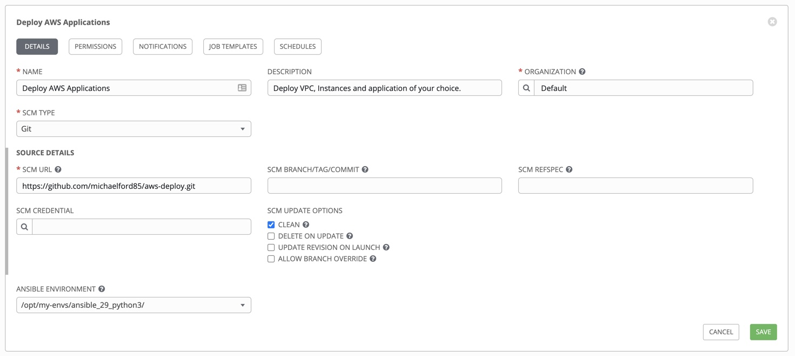

# Preparing Ansible Tower Project and Cloud Credentials

Once Ansible Tower is deployed, you need to do some initial setup in order to ingest playbooks and cloud credentials and make them available for use.


<!-- # Table Of Contents
- [Software Requirements](#requirements)
- [Variables](#variables)
  * [default-vars.yml](#default-variables)
  * [linux_users.yml](#linux-users)
- [Credentials](#credentials)
  * [gmail_creds.yml](#gmail-credentials)
  * [redhat-activation-key.yml](#redhat-activation-key)
  * [snow_creds.yml](#servicenow-credentials)
  * [tower_creds.yml](#tower-credentials)
  * [vault_creds.yml](#hashicorp-vault-credentials) -->

## Ansible Tower Project

Under Resources --> Projects, create a new Project with the following attributes:



I have elected to create a custom Python virtual environment that supports Python3. While this is not necessary for an Ansible Tower installation on Centos 8/RHEL 8 (which only comes with Python3), you can set up a custom Python virtual environent per [these instructions](https://docs.ansible.com/ansible-tower/latest/html/upgrade-migration-guide/virtualenv.html) (See section 4.1).


## Cloud Provider Credentials

Under Resources --> Projects, create a new set of credentials of the appropriate type. The example below, is for AWS programmatic keys, which you can generate in the AWS console:


Of course, you must ensure that programmatic credentials you generate are for a user (or service account) that has permissions to create the cloud resources this demo generates.

Lastly, Ansible Tower automatically encrypts any secrets, which in the case of AWS is the *Secret Key*. Ansible Tower users (with appropriate permissions) can use the credential without knowing its contents.

## Job Templates

Once you have the Project and Credential set up, you can now move to setting up the individual Job Templates that will do the work against your cloud environment. Below is a description of each Job Template, and its required parameters. In general, you can expect a Job Template to look similar to this picture:


### Open ServiceNow Change Request and wait for Approval

Description:

| Parameter | Value |
|-----|-----|
| Name  | Open ServiceNow Change Request and wait for Approval  |
|  Job Type |  Run |
|  Inventory |  Demo Inventory |
|  Project |  Deploy AWS Applications |
|  Playbook |  `snow-cr-open-and-wait.yml` |
|  Credential |  `ansible-vault password` |

### Provision AWS resources

Description:

| Parameter | Value |
|-----|-----|
| Name  | Provision AWS resources  |
|  Job Type |  Run |
|  Inventory |  Demo Inventory |
|  Project |  Deploy AWS Applications |
|  Playbook |  `provision_resources.yml` |
|  Credential |  `ansible-vault password`, `Cloud Programmatic Key` |

#### Extra Variables
```
ec2_region: us-east-1
num_instances: 3
ec2_wait: yes
ec2_vpc_subnet: "192.168.0.0/28"
ec2_vpc_cidr: "192.168.0.0/24"
```

### Provision AWS Linux Instances

Description:

| Parameter | Value |
|-----|-----|
| Name  | Provision AWS Linux Instances  |
|  Job Type |  Run |
|  Inventory |  Demo Inventory |
|  Project |  Deploy AWS Applications |
|  Playbook |  `provision_servers_tower.yml` |
|  Credential |  `ansible-vault password`, `Cloud Programmatic Key` |

#### Extra Variables
```
ec2_region: us-east-1
ec2_wait: yes
ec2_vpc_subnet: "192.168.0.0/28"
ec2_vpc_cidr: "192.168.0.0/24"
```

### Teardown AWS Linux Resources

Description:

| Parameter | Value |
|-----|-----|
| Name  | Teardown AWS Linux Resources  |
|  Job Type |  Run |
|  Inventory |  Demo Inventory |
|  Project |  Deploy AWS Applications |
|  Playbook |  `teardown_resources.yml` |
|  Credential |  `Cloud Programmatic Key` |

### Install Docker Engine on Linux Instances

Description:

| Parameter | Value |
|-----|-----|
| Name  | Install Docker Engine on Linux Instances  |
|  Job Type |  Run |
|  Inventory |  Demo Inventory |
|  Project |  Deploy AWS Applications |
|  Playbook |  `install-docker-engine.yml` |
|  Credential |  `ansible-vault password`, `AWS Demo Instances Key` |


## Next Steps

- Go back to the first page of instructions: [Governing Self-Service Cloud Provisioning](../README.md)
- Continue to the next step: [Setting up the Ansible Tower Workflow](tower_workflow.md)
