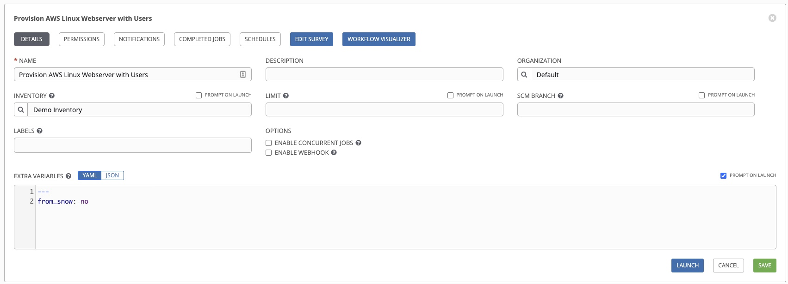
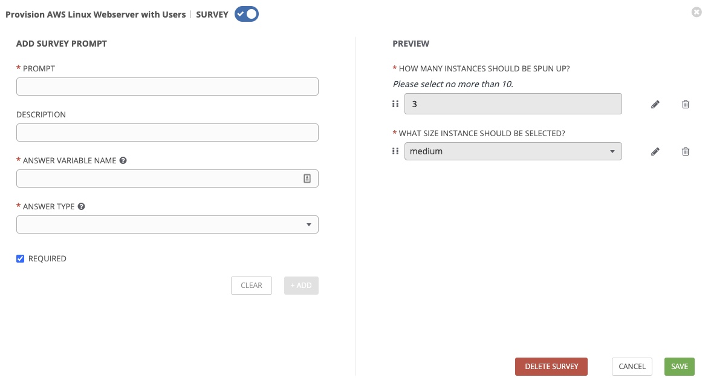
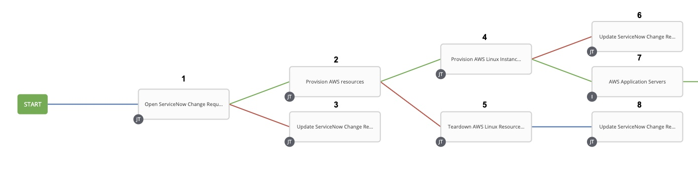
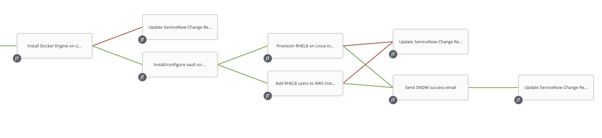
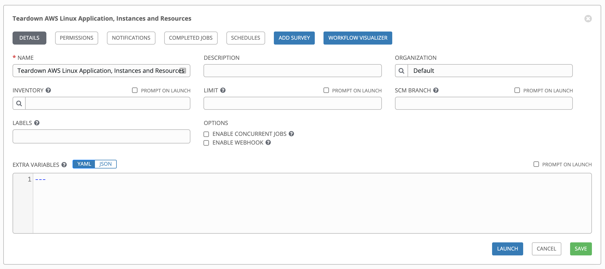
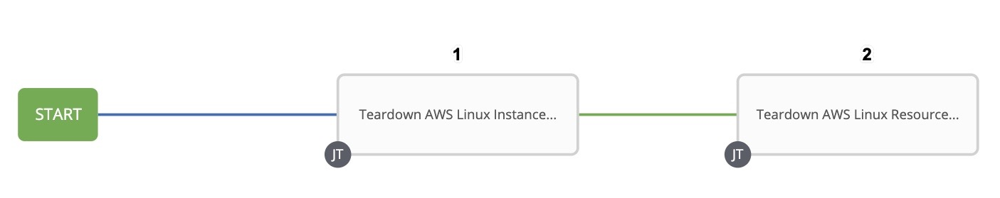

# Setting up the Ansible Tower Workflow

After creating the individual Ansible Tower Job Templates, you can put them together in a Workflow Template for end-to-end deployment.

Workflow Templates are valuable for automation teams as they allow domain experts to maintain control of their individual responsibilities (they can own the playbook that governs their part of the architecture) while providing the ability to deploy entire services holistically. Workflow Templates also allow for error handling and atomic changes.

In this demo, you will create two workflows; one for *provisioning* your cloud workload, and another for *tearing it down*. these instructions will walk you through setting up the workflow and the parameters for each part of the workflow.

**Cloud workload provisioning Workflow Template:**


I will break this into two smaller images later in the documentation.

**Cloud workload teardown Workflow Template:**


In the Workflow Templates above, each box represents an invocation of one of the Job Templates we defined in the previous section. The lines represent contracts between those Job Templates, and are color-coded accordingly:
- A **blue** line means that the Job Template to the right of it will always run.
- A **green** line means that the Job Template to the right of it will only run of the Job Template to the left of it, ran successfully.
- A **red** line means that the Job Template to the right of it will only run of the Job Template to the left of it, failed.

In cases where a Job Template has two green lines leading to it, like so:


Set the `Convergence` parameter of the resulting Workflow Node (in this case, *Send SNOW success email*). This way, *both* of the previous Job Templates must succeed in order to proceed upon the success path, which is the desired behavior.

# Provisioner Workflow Template

First, let's walk through the provisioner Workflow Template.

You can set up the Workflow Template by navigating to Resources --> Templates, and clicking on the green + button, selecting to create a Workflow Template.

For the provisioner template, fill out the fields as follows:



  | Parameter | Value |
  |-----|-----|
  | Name  | Provision AWS Linux Webserver with Users  |
  | Organization  | Default  |
  |  Inventory | Demo Inventory |

#### Extra Variables (check the box marked `PROMPT ON LAUNCH`)
  ```
	---
  from_snow: no
  ```

For starting this Workflow Template from Ansible Tower, the Workflow requires two parameters, asking for the number of RHEL 8 instances the user wishes to deploy, and how big they need to be.

The survey will look like this:



Here are the details required for both questions:

| Parameter | Value |
|-----|-----|
| Prompt  | How many instances should be spun up?  |
| Description  | Please select no more than 10.  |
|  Answer Variable Name | `num_instances` |
|  Answer Type |  Integer |
|  Minimum |  `1` |
|  Maximum |  `10` |
|  Default Answer |  `3` |
|  Required |  Checkmark |

| Parameter | Value |
|-----|-----|
| Prompt  | What size instance should be selected?  |
|  Answer Variable Name | `instance_size` |
|  Answer Type |  Multiple Choice (single select) |
|  Multiple Choice Options |  `small`, `medium`, `large` |
|  Default Answer |  `medium` |
|  Required |  Checkmark |

When setting up the Workflow Template visualizer, you can select the next step by clicking on the START button:


From there, you can choose the Job Template, when it runs (`Always` for the first selection, `Always`, `On Success`, or `On Failure` for subsequent Job Templates), convergence (`All` or `Any`), and any prompts if necessary. Each Job Template will give these details.



## 1) Open ServiceNow Change Request and wait for Approval

| Parameter | Value |
|-----|-----|
| Node Type  | Template  |
|  Template Name |  Open ServiceNow Change Request and wait for Approval |
|  Run |  Always |
|  Convergence |  Any |

## 2) Provision AWS Resources

| Parameter | Value |
|-----|-----|
| Node Type  | Template  |
|  Template Name |  Provision AWS Resources |
|  Run |  On Success |
|  Convergence |  Any |

## 3) Update ServiceNow Change Request

| Parameter | Value |
|-----|-----|
| Node Type  | Template  |
|  Template Name |  Update ServiceNow Change Request |
|  Run |  On Failure |
|  Convergence |  Any |

**PROMPT:**
```
---
close_state: 4
close_code: unsuccessful
close_notes: 'Canceled by Ansible: Approval not given within allotted time.'
```

## 4) Provision AWS Linux Instances

| Parameter | Value |
|-----|-----|
| Node Type  | Template  |
|  Template Name |  Provision AWS Linux Instances |
|  Run |  On Success |
|  Convergence |  Any |

## 5) Teardown AWS Linux Resources

| Parameter | Value |
|-----|-----|
| Node Type  | Template  |
|  Template Name |  Teardown AWS Linux Resources |
|  Run |  On Failure |
|  Convergence |  Any |

## 6) Update ServiceNow Change Request

| Parameter | Value |
|-----|-----|
| Node Type  | Template  |
|  Template Name |  Update ServiceNow Change Request |
|  Run |  Always |
|  Convergence |  Any |

**PROMPT:**
```
---
close_state: 4
close_code: unsuccessful
close_notes: 'Canceled by Ansible: Linux instances not created successfully.'
```

## 7) AWS Application Servers

| Parameter | Value |
|-----|-----|
| Node Type  | Inventory Sync  |
|  Inventory Name |  AWS Application Servers |
|  Run |  On Success |
|  Convergence |  Any |

## 8) Update ServiceNow Change Request

| Parameter | Value |
|-----|-----|
| Node Type  | Template  |
|  Template Name |  Update ServiceNow Change Request |
|  Run |  Always |
|  Convergence |  Any |

**PROMPT:**
```
---
close_state: 4
close_code: unsuccessful
close_notes: 'Canceled by Ansible: Problem when trying to provision network resources.'
```


  

## 9) Install Docker Engine on Linux Instances

| Parameter | Value |
|-----|-----|
| Node Type  | Template  |
|  Template Name |  Update ServiceNow Change Request |
|  Run |  On Success |
|  Convergence |  Any |

## 10) Update ServiceNow Change Request

| Parameter | Value |
|-----|-----|
| Node Type  | Template  |
|  Template Name |  Update ServiceNow Change Request |
|  Run |  On Failure |
|  Convergence |  Any |

**PROMPT:**
```
---
close_state: 4
close_code: unsuccessful
close_notes: 'Canceled by Ansible: Error when trying to install Docker.'
```

## 11) Install/configure vault on Linux Docker instance

| Parameter | Value |
|-----|-----|
| Node Type  | Template  |
|  Template Name |  Install/configure vault on Linux Docker instance |
|  Run |  On Success |
|  Convergence |  Any |

## 12) Provision RHEL8 on Linux Instances

| Parameter | Value |
|-----|-----|
| Node Type  | Template  |
|  Template Name |  Provision RHEL8 on Linux Instances |
|  Run |  On Success |
|  Convergence |  Any |

## 13) Add RHEL8 users to AWS Instances

| Parameter | Value |
|-----|-----|
| Node Type  | Template  |
|  Template Name |  Add RHEL8 users to AWS Instances |
|  Run |  On Success |
|  Convergence |  Any |

## 14) Update ServiceNow Change Request

| Parameter | Value |
|-----|-----|
| Node Type  | Template  |
|  Template Name |  Update ServiceNow Change Request |
|  Run |  On Failure |
|  Convergence |  Any |

**PROMPT:**
```
---
close_state: 4
close_code: unsuccessful
close_notes: 'Canceled by Ansible: Error in provisioning RHEL8 application and users.'
```

## 15) Send SNOW success email

| Parameter | Value |
|-----|-----|
| Node Type  | Template  |
|  Template Name |  Send SNOW success email |
|  Run |  On Success |
|  Convergence |  All |

## 16) Update ServiceNow Change Request

| Parameter | Value |
|-----|-----|
| Node Type  | Template  |
|  Template Name |  Update ServiceNow Change Request |
|  Run |  On Success |
|  Convergence |  Any |

**PROMPT:**
```
---
close_state: 3
close_code: successful
close_notes: Linux Instances deployed successfully!
```

# Teardown Workflow Template

Finally, let's walk through the teardown Workflow Template:



  | Parameter | Value |
  |-----|-----|
  | Name  | Teardown AWS Linux Application, Instances and Resources  |
  | Organization  | Default  |
  |  Inventory | Demo Inventory |



## 1) Teardown AWS Linux Instances

| Parameter | Value |
|-----|-----|
| Node Type  | Template  |
|  Template Name |  Teardown AWS Linux Instances |
|  Run |  Always |
|  Convergence |  Any |

## 2) Teardown AWS Linux Resources

| Parameter | Value |
|-----|-----|
| Node Type  | Template  |
|  Template Name |  Teardown AWS Linux Resources |
|  Run |  On Success |
|  Convergence |  Any |

Now, you're ready to run deploy your cloud resources.


## Next Steps

- Go back to the first page of instructions: [Governing Self-Service Cloud Provisioning](../README.md)
- Continue to the next step: [The Payoff: Deploying Your Cloud Workload](workflow_kickoff.md)
<!-- # Table Of Contents
- [Software Requirements](#requirements)
- [Variables](#variables)
  * [default-vars.yml](#default-variables)
  * [linux_users.yml](#linux-users)
- [Credentials](#credentials)
  * [gmail_creds.yml](#gmail-credentials)
  * [redhat-activation-key.yml](#redhat-activation-key)
  * [snow_creds.yml](#servicenow-credentials)
  * [tower_creds.yml](#tower-credentials)
  * [vault_creds.yml](#hashicorp-vault-credentials)

## Requirements -->
