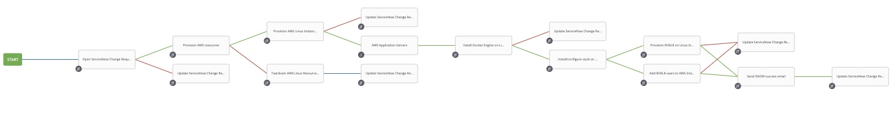
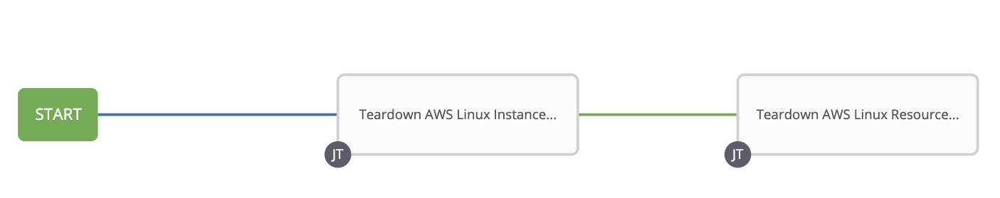

# Setting up the Ansible Tower Workflow

After creating the individual Ansible Tower Job Templates, you can put them together in a Workflow Template for end-to-end deployment.

Workflow Templates are valuable for automation teams as they allow domain experts to maintain control of their individual responsibilities (they can own the playbook that governs their part of the architecture) while providing the ability to deploy entire services holistically. Workflow Templates also allow for error handling and atomic changes.

In this demo, you will create two workflows; one for deploying your cloud workload, and another for tearing it down. these instructions will walk you through setting up the workflow and the parameters for each part of the workflow.

Cloud workload provisioning Workflow Template:

I will break this into two smaller images later in the documentation.

Cloud workload teardown Workflow Template:

In the Workflow Templates above, each box represents an invocation of one of the Job Templates we defined in the previous section. The lines represent contracts between those Job Templates, and are color-coded accordingly:
- A **blue** line means that the Job Template to the right of it will always run.
- A **green** line means that the Job Template to the right of it will only run of the Job Template to the left of it, ran successfully.
- A **red** line means that the Job Template to the right of it will only run of the Job Template to the left of it, failed.

In cases where a Job Template has two green lines leading to it, like so:

*Both* of the previous Job Templates must succeed in order to proceed upon the success path.

# Provisioner Workflow Template

First, let's walk through the provisioner Workflow Template.

<!-- # Table Of Contents
- [Software Requirements](#requirements)
- [Variables](#variables)
  * [default-vars.yml](#default-variables)
  * [linux_users.yml](#linux-users)
- [Credentials](#credentials)
  * [gmail_creds.yml](#gmail-credentials)
  * [redhat-activation-key.yml](#redhat-activation-key)
  * [snow_creds.yml](#servicenow-credentials)
  * [tower_creds.yml](#tower-credentials)
  * [vault_creds.yml](#hashicorp-vault-credentials)

## Requirements -->
