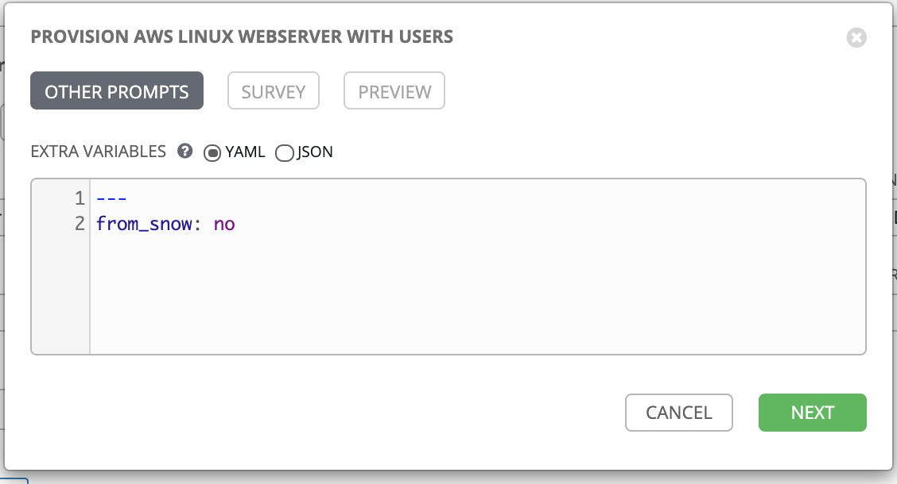
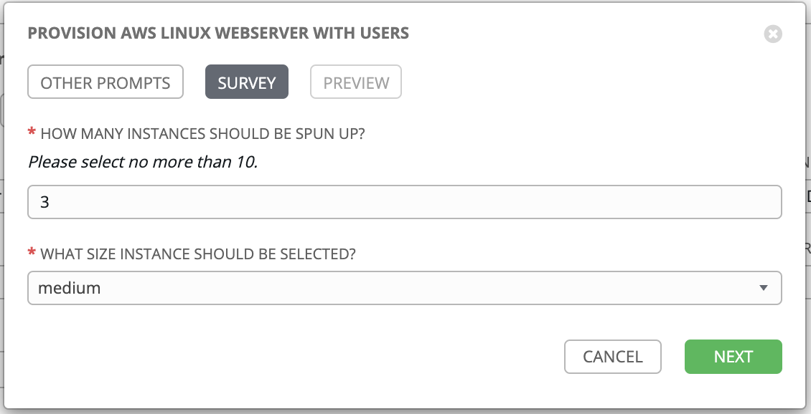
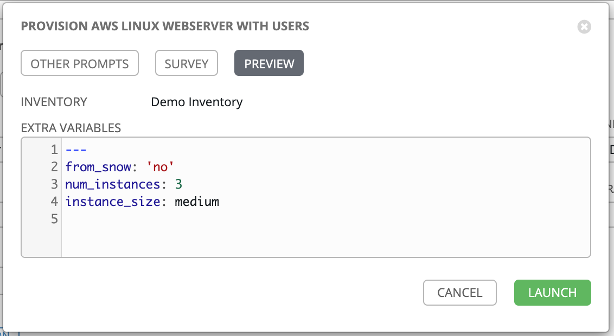
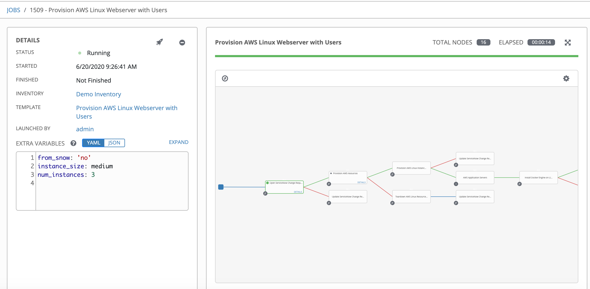

# The Payoff: Deploying Your Cloud Workload

Now that you have created your two Workflow Templates, you can use them to both provision and teardown your cloud workloads.

## Running the Provisioner Template

Under Resources --> Templates, click on the rocket ship button next to the Workflow Template, **Provision AWS Linux Webserver with Users**. You will be presented with two boxes for options. First, as the **Extra Variables** section has been set to `PROMPT ON LAUNCH`, you will be given the opportunity to change the `from_snow` variable to `yes` or `no`. Leave this value as `no`; this value should only be set to yes when the request for the WorkflowTemplate comes from ServiceNow (which will be covered in the next section):

Click **Next**.

Second, you will be presented with a survey, asking how many instances you would like to spin up (this must be between 1 and 10), and how large you would like them to be:

Click **Next**.

You will then be presented with a summary of the parameters you have selected to be added to the Workflow Template. Some of the variables you will be passing in are also defined in the individual Job Templates; Ansible variable precedence will dictate that the Workflow parameters will override anything defined in the Job Templates:

Click **Launch**.

Ansible Tower will then take you to a screen showing the Workflow Template in its running state:

The playbooks have been architected in such a way that any function of ServiceNow is skipped when ServiceNow does not invoke the Workflow Template (this is where the `from_snow` variable comes into play). You can observe the Workflow Template advancing as Template Nodes are completed. If a Template node completes successfully, The outline will change to **green**; failure will result in a **red** outline. Once a Template node begins running, you can click on the *Details* link inside the node, to see the details of the Job Template or Inventory Sync.

### Results of the Provisioner Template

RHEL 8 instances of the size and number specified in the Workflow Template are created. An additional instance that hosts the secrets engine is also created. If you look at the results of the **Add RHEL8 users** Job Template, you can see all these instances:

The instances have metadata applied that ensures that the vault instance is untouched when running a Job Template only intended to run against the requested RHEL 8 instances.

### RHEL 8 Instances

RHEL 8 instances of the size and number specified in the Workflow Template are created, each with Apache installed, and a dynamically generated web page inserted. You can plug the IP address of any of these instances into your browser and see the following:

Note the timestamp on the bottom.

### Hashicorp vault

Hashicorp vault is deployed as a container on the additional instance. You can log into it via the public IP Address assigned to the instance, on port 8200. You can use your vault_root_token variable, which for this example is typically set to `ansible` (this is simply a dev instance of vault):

After logging in, you can navigate to the key-value secrets engine named *rhel*, and then click on the *users* path, where you will see the SSH Private Key, base64 encoded, for each user (and yes, these are all the Star Trek captains):

If you wish to pull down the secrets for logging in, run the following from your terminal:

- Set vault environment variable:
`export VAULT_ADDR=http://<vault_IP_Address>:8200`
- Log into vault with root token
`vault login {{ vault_root_token }}`
- retrieve password, decode and place into file
`vault kv get --field=rapril_password rhel/users/ | base64 -D > key_file.pem`

You will be prompted to create a password for this user. The password must have an uppercase letter, a lowercase letter, a number, and special character. Once created, the server will disconnect and you will be able to log in with the password you just created:
`ssh -o IdentitiesOnly=yes rapril@<webserver_IP_Address>`

Each of these users have sudo privileges as well.

**NOTE**: to log out of vault, delete the token file which should be located at `~/.vault-token` on your client.

### Cloud Resources

Of course, these compute resources do not exist in a vaccuum; the underlying virtual private cloud, subnet, security groups, internet gateway, are all present in your cloud account.

## Running the Teardown Template

The Teardown Template is less involved to run. Simply click on the rocketship button next to the Workflow Template **Teardown AWS Linux Application, Instances and Resources**. The Workflow Template searches for the cloud resources based on metadata defined in the [default-vars.yml](../vars/default-vars.yml) file, and will tear down all instances and resources without any further user input.
